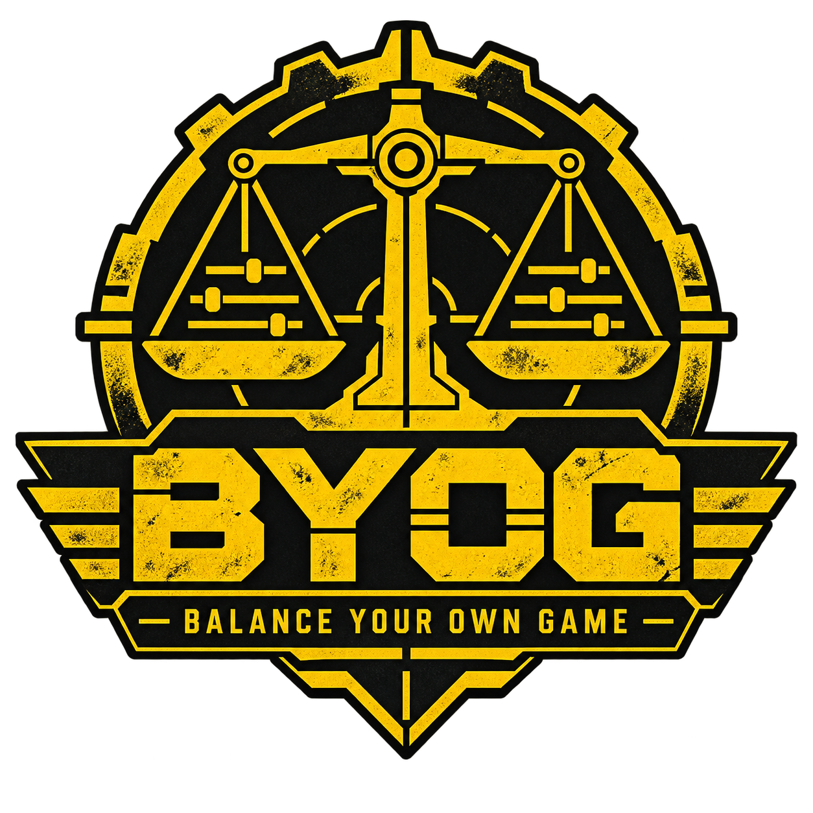

<p align="center"></p>

# BYOG — Balance Your Own Game

A Helldivers 2 mod that lets you change the numbers of the game from inside the game: damage, armor
penetration, fire rate, recoil, magazines, explosions, stratagem cooldowns, sentry lifetime, backpack
charges, shield and vehicle health, and more. Every value is set on its own, for one item at a time.

Download: [`dist/BYOG-v1.0.0.zip`](dist/BYOG-v1.0.0.zip)

## What you need

* Helldivers 2, game build `release/01.007.101/19155`. On any other build the mod loads, writes
  nothing, and says so in `STATUS.txt`: a game update needs a new version of the mod.
* Bingus Shared Loader v15 or newer, and a mod manager that installs addon packages (Arsenal).

## Install

1. Add `BYOG-v1.0.0.zip` to your mod manager, enable it, deploy.
2. Start the game. Press **F9**.

To remove it: disable the mod in the manager. Your settings stay in `%LOCALAPPDATA%\BYOG`; delete that
folder to forget them.

## The menu

| Key | What it does |
|---|---|
| **F9** | open / close |
| **Up / Down**, **PageUp / PageDown** | move (ten rows) |
| **Tab** | item list ↔ value list |
| **Left / Right** | in the item list: category. In the value list: lower / raise the value (**Shift**: ten times the step) |
| **Delete** | in the value list: back to the game's value. In the item list: clear the search |
| **letters, digits** | in the item list: search in every category. **Backspace** removes a letter |

A change is applied at once and kept in `%LOCALAPPDATA%\BYOG\menu.txt`, so it is still there the next
time you start the game. Some values are read by the game when a thing is created: a magazine size or
a vehicle's health shows on the next weapon or vehicle, a stratagem's cooldown after its next use.

## What can be changed

| Category | Items | Values |
|---|---|---|
| `weapon` | 114 primary, secondary, support and melee weapons | damage, durable damage, armor penetration per angle, demolition, stagger, push, fire rate, projectile speed / drag / gravity, pellets, blast radius and blast damage, magazine size and counts, recoil, spread, sway, ergonomics, heat, status effects |
| `throwable` | 31 grenades and mines | amounts, fuse, throw distance, blast radius and damage |
| `stratagem_weapon` | 53: sentry, emplacement, drone, exosuit and Eagle guns; orbital and Eagle shells | the same values as a weapon; lifetime and sight range of sentries |
| `stratagem` | 149 | cooldown, uses |
| `backpack` | 18 | charges, starting charges, refill |
| `shield` | 4 | health, radius, recharge delay and rate, lifetime of the relay |
| `vehicle` | 14 | health, armor, and for every part its own health, armor and how much of its damage reaches the vehicle |

Many weapons share one round in the game's data (the Liberator and the Stalwart, a sentry and the
MG-43). BYOG gives a weapon data of its own the moment you change it, so a change reaches that weapon
only.

## The config file

Everything the menu does can also be written in `%LOCALAPPDATA%\BYOG\config.txt` (created on first
run; **F10** reads it again). `catalog.txt` in the same folder lists every item and value with the
game's own number and the allowed range. The format is described in
[`docs/CONFIG-FORMAT.md`](docs/CONFIG-FORMAT.md). A value set in the menu wins over the same value in
config.txt.

`STATUS.txt` says what happened: its first line is the verdict (`OK - 5 values applied`), and every
line of your config is listed with its result.

## Good to know

* **Multiplayer.** Tested by the authors in their own lobbies without problems. Use it with people
  who know you are using it; changing the game for strangers is not what this is for.
* **Game updates.** The mod checks the game's files before it writes anything. After an update it
  refuses until a new version is released.
* **Keys.** While the menu is open the game still receives the keys you press. Typing a search moves
  your character; use the menu on the ship or when it is safe.
* **Names.** Items the mod knows the game's name of are shown by that name, the others by the game's
  internal name. The list is in [`tools/display_names.txt`](tools/display_names.txt); corrections are
  welcome.
* **Borrowed explosion rows.** A few items share an explosion with something else. To separate them
  the mod reuses explosion entries that nothing in the game's data refers to. If some unrelated
  explosion ever looks like the weapon you edited, that is the cause: remove the edit and report it.
* **Use at your own risk.** The mod changes the running game's memory from inside the game. It is
  not made, approved or supported by Arrowhead Game Studios or Sony.

## For developers

| Path | What |
|---|---|
| `src/tuner/tuner.lua` | the mod (one file, LuaJIT; version in `src/tuner/version.txt`) |
| `tools/` | offline analysis and build tooling (Python 3.10+, standard library only) |
| `tests/` | offline tests: a fake game, mutation tests, tests against the real Windows API |
| `docs/STAT-MAP.md` | every value: table, field, offset, type, how it was confirmed |
| `docs/CONFIG-FORMAT.md` | the config file format |
| `docs/test-rounds/` | the checklists of the in-game test rounds (Turkish) |
| `src/recon/` | the read-only diagnostic addon used at the start of the project |

```
python tools/build_catalog.py         # every value resolved from the game's data -> data/catalog.json
python tools/pack_addon.py tuner      # -> build/tuner.lua, dist/BYOG-v<version>.zip
python -m unittest tests.test_tuner tests.test_real_tuner tests.test_recon tests.test_real_ffi
```

The tests need `lupa` (a LuaJIT runtime for Python) in a virtual environment. `data/`, `build/` and
`reference/` (third-party repositories read for research) are not part of the repository.

Rules this project follows: game memory is only touched from inside the game, through the loader; no
offset is guessed; nothing is written on a game build that was not verified; every write is
range-checked, read back, and undone when it is no longer wanted. No code of other mods is used.

## License

MIT, see [`LICENSE`](LICENSE). The logo is not covered by it.
